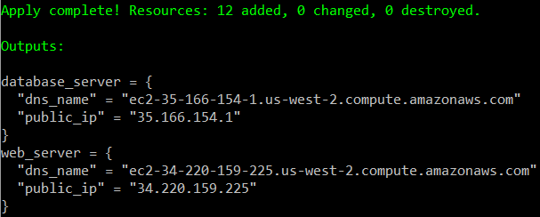
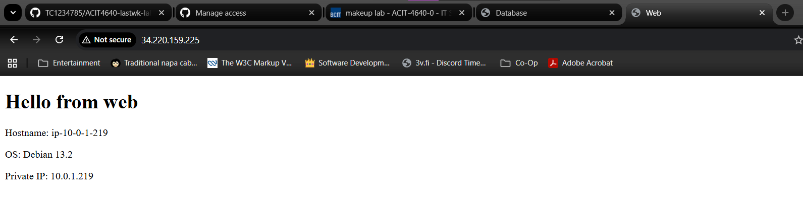
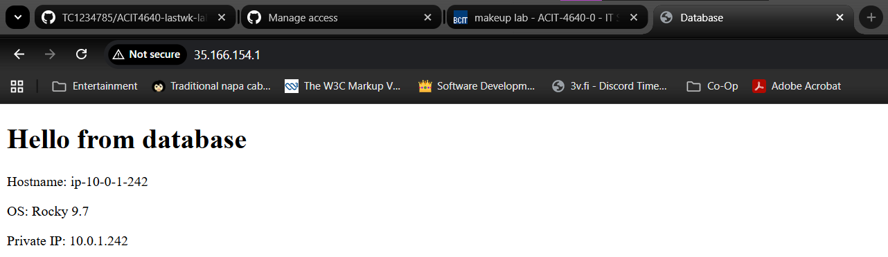

# Week 12 Lab 

## Lab Steps

### 1. Generate SSH Key Pair

```bash
ssh-keygen -t rsa -b 4096 -f ~/.ssh/lastwk -N ""
```

### 2. Upload SSH Key to AWS

```bash
scripts/import-ssh-key ~/.ssh/lastwk.pub
```

### 3. Set SSH Key Permissions

```bash
chmod 600 ~/.ssh/lastwk
```

### 4. Terraform - Initialize

```bash
cd terraform
terraform init
```

### 5. Terraform

```bash
terraform fmt
terraform plan
terraform apply
```
Type `yes` when prompted.

### 6. Run Ansible Playbook

```bash
cd ../ansible
ansible-playbook playbook.yml
```


### 7. Verify Deployment

Open browser and navigate to the public IP addresses (from terraform output):

- **Web Server**: `http://<web_public_ip>`
  - Should display: "Hello from web"
  
- **Database Server**: `http://<database_public_ip>`
  - Should display: "Hello from database"

## Screenshots


 

### 8. Cleanup
```bash
cd ../terraform
terraform destroy
```

Type `yes` when prompted.
